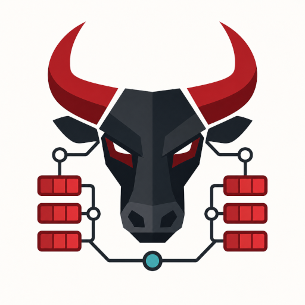

<p align="center">
  
</p>

# node-red-contrib-bull

Node-RED nodes for BullMQ-backed Redis job queues.

This migration targets BullMQ 5.78.0, Node-RED 4.1, and Node.js 24 or newer. It preserves the legacy `bull-queue-server`, `bull cmd`, and `bull run` node types where BullMQ has compatible behavior, and adds `bull job`, `bull events`, and `bull flow`.

## Requirements

- Node.js 24+
- Node-RED 4.1.x
- Redis with `maxmemory-policy=noeviction`
- BullMQ 5.78.0

Bull v4 Redis data is not automatically migrated. Drain, retire, or otherwise handle old Bull queues before upgrading the runtime dependency.

## Nodes

- `bull-queue-server`: shared BullMQ queue and Redis deployment config.
- `bull cmd`: message-driven producer and queue administration commands.
- `bull run`: BullMQ Worker that emits jobs into a Node-RED flow.
- `bull job`: manual acknowledgement and active-job actions for manual `bull run` flows.
- `bull events`: QueueEvents source node for global BullMQ events.
- `bull flow`: FlowProducer node for parent/child job trees.

## Redis Deployments

Supported deployment modes:

- Standalone Redis
- Redis Cluster
- AWS MemoryDB, configured as Redis Cluster with TLS
- Redis Sentinel

Authentication can use Redis ACL username/password. TLS supports CA, client certificate, client key, server name, and certificate verification. Cluster and MemoryDB deployments should use a BullMQ prefix with a hash tag, such as `{bull}`, to keep queue keys in one Redis Cluster slot for atomic operations.

## Legacy Repeat Cron Compatibility

The legacy repeat flow remains supported through BullMQ Job Schedulers:

```js
msg.payload = "gateway-FCC23DFFFE0AA2A8";
msg.cmd = "add";
msg.jobopts = {
  jobId: msg.payload,
  repeat: {
    cron: "30 9,19,29,39,49,59 * * * *",
  },
};
return msg;
```

The scheduler id is `msg.schedulerId` when present, otherwise `msg.jobopts.jobId`. `repeat.cron` is translated to `repeat.pattern`; conflicting `cron` and `pattern` values are rejected.

## Commands

`bull cmd` reads `msg.cmd`. The default command is `add`.

Core supported command families include:

- add jobs, add bulk jobs, get jobs, retry jobs, remove jobs
- delayed jobs and delay promotion
- priorities and priority counts
- deduplication keys
- Job Scheduler commands and legacy repeat aliases
- pause, resume, drain, clean, and `stopAndRemoveAllJobs`
- global concurrency and rate limits
- job logs and Prometheus metrics export

See [docs/COMMANDS.md](docs/COMMANDS.md).

## Unsupported

| BullMQ feature | Reason |
| --- | --- |
| Sandboxed processors | They bypass the Node-RED flow and downstream acknowledgement model. |
| Custom JavaScript backoff strategies | Executable strategy code is not a safe Node-RED message contract. Use built-in fixed/exponential backoff. |
| BullMQ Pro features | Pro groups, batches, and observables are not part of the open-source BullMQ dependency. |
| Built-in dashboard | Use a dedicated queue UI; this package only provides Node-RED nodes. |
| Arbitrary method proxying | Unrestricted method dispatch is hard to validate, document, secure, and test. |
| Automatic Bull v4 Redis data migration | Bull and BullMQ do not provide a supported queue-data migration contract. |

## Examples

Import [examples/example_flow.json](examples/example_flow.json) into Node-RED. It includes:

- simple add and run
- required `basecasts` scheduled job
- delayed and prioritized jobs
- manual acknowledgement
- QueueEvents
- parent/child flow producer

The examples do not contain secrets.

## Development

```sh
npm install
npm test
```

Use [docs/TESTING.md](docs/TESTING.md) for Docker, Playwright, and MemoryDB test plans. Use [docs/CHANGE_WORKFLOW.md](docs/CHANGE_WORKFLOW.md) before changing behavior.

## More Docs

- [Architecture](docs/ARCHITECTURE.md)
- [Node Guide](docs/NODE_GUIDE.md)
- [Connection Guide](docs/CONNECTIONS.md)
- [Migration Guide](docs/MIGRATION.md)
- [Troubleshooting](docs/TROUBLESHOOTING.md)
